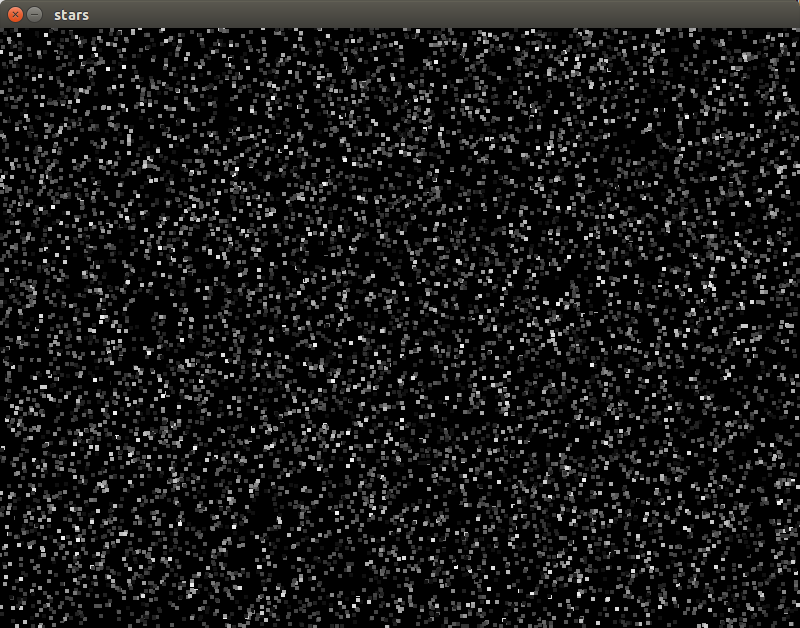

# go-SDL-experiements

Author: [Charney Kaye](http://w.charney.io)

# Stars

    go run stars.go

# Radar Stars

    go run radar_stars.go

# Stars in Goroutine (anti-pattern)

This performs poorly- it's included only to potentially investigate *why* it performs so poorly.

    go run stars_goroutine.go

## Tips

### Texture Garbage Collection 

Be sure to call `texture.Destroy` once you're done with a texture.

    defer g.sdlScreenTexture.Destroy()

### Don't overload the frame buffer

Enabling vsync for the renderer helped reduce cpu usage a good amount (so that it doesn't draw multiple times in the same frame).

    g.sdlRenderer, err = sdl.CreateRenderer(g.sdlWindow, -1, sdl.RENDERER_ACCELERATED|sdl.RENDERER_PRESENTVSYNC)
